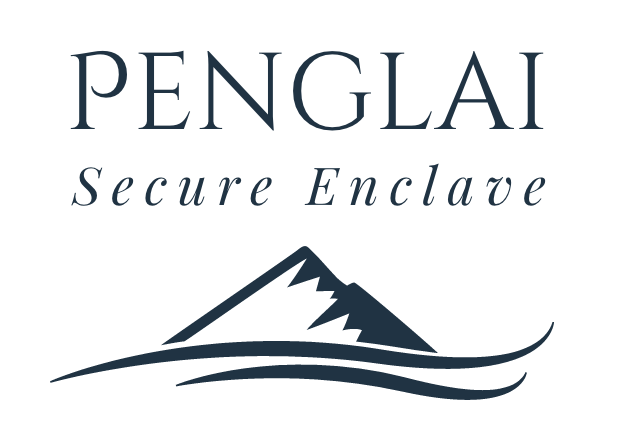

Penglai-Enclave is a scalable enclave system for RISC-V architecture.

## RoadMap

| Features                    | Status         | Schedule   |
|-----------------------------|----------------|------------|
| Cross-enclave communication | Internal ready | 2020-11-15 |
| Support OpenSBI-based stack | Done           | 2020-11-6  |
| Secure storage              | Internal ready | 2020-11-30 |
| Support PSA framework       | WIP            | TBD        |
| Tutorial to use Penglai     | Internal ready | 2020-11-30 |
| Enclave Fork                | Internal ready | TBD        |
| Formal verification         | WIP            | TBD        |

Although some features have been implemented in our internal version,
they still need some works to be ready to be open-sourced.

The schedule field is the **expected** time to release the features.

## Info

- OpenSBI-based Penglai is maintained in [Nuclei SDK](https://github.com/Nuclei-Software/nuclei-linux-sdk/tree/dev_flash_penglai_spmp) now.

## Quick Start

Penglai uses Docker for building and uses submodules to track different componets.

Therefore, the only requirement to build and run penglai-demo is:

- [Docker](https://docs.docker.com): for building/running Penglai
- Git: for downloading the code

The version for FPGA and RISC-V board is comming soon.

### Building

First, download the all the code:

`git clone https://github.com/Penglai-Enclave/Penglai-Enclave.git`

Enter the penglai-enclave directory, `cd Penglai-Enclave`

And then,

`git submodule update --init --recursive`

Last, build penglai using our Docker image:

`./docker_cmd.sh build`

When the building process finished, you are ready to run the penglai demo.

## Running

In the penglai-enclave directory,

`./docker_cmd.sh qemu`

If everything is fine, you will enter a Linux terminal booted by Qemu with Penglai-installed.

Enter the terminal with the user name: root, and passwords: penglai.

**Insmod the enclave-driver**

`insmod penglai.ko`

And the, you can run a demo, e.g., a prime enclave, using

`./host  prime`

Here, the  `host` is an enclave invoker, which will start an enclave (name from input).

## License Details

Mulan Permissive Software License，Version 1 (Mulan PSL v1)

## Code Structures

- buildroot: The buildroot rootfs for Penglai (from Sifive's Freedom U-sdk)
- linux: The Untrusted OS kernel (kernel 4.15) for Penglai (from Sifive's Freedom U-sdk)
- monitor: The secure monitor of Penglai, implementing isolation using PMP/sPMP, based on BBL
- riscv-qemu: The modified qemu (4.1) to support sPMP
- scripts: some scripts to build/run Penglai demo
- conf: some configuration files to build Penglai
- copy-files: a temp dir to store files copied into Penglai

## Code Contributions

If you are developing Penglai, please use pull requests on **target submodule project** (not on the super project).

Please fell free to post your concerns, ideas, code or anything others to issues.

## Wiki

Please refer the wiki for more details
