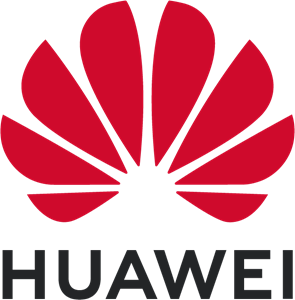

[](https://github.com/Penglai-Enclave/Penglai-Enclave-sPMP/actions/workflows/build.yml)

[](https://license.coscl.org.cn/MulanPSL)


## Introduction

Penglai is a RISC-V TEE system, which is designed to be **secure**, **high-performant**, and **scalable**.
This repo maintains OpenSBI version of Penglai Enclave based on PMP.

**How to use?**

Simply replace the OpenSBI used in your system with opensbi-0.9 in the top directory in the repo.

You can use our SDK and enclave-driver to build your trusted applications, or even write your own SDKs.

## Status and Info

- Status: experimental: it's still experimental version now, please refer our TVM version for more features.
- Hardware requirement: riscv qemu (suggested version: >= 5.2.0) is fine
- Supported software system: This repo contains resources to run openEuler with Penglai TEE.
- Real devices: Penglai for Nuclei devices is maintained in [Nuclei Linux SDK](https://github.com/Nuclei-Software/nuclei-linux-sdk/tree/dev_flash_penglai_spmp).

You can turn to BBL-version by switching to the master branch.

You can refer our [Penglai-TVM](https://github.com/Penglai-Enclave/Penglai-Enclave-TVM) for more advanced features, including inter-enclave communication, secure storage, shadow fork, and others.

## Case: Running openEuler with Penglai

### Requirements

Penglai uses Docker for building and uses submodules to track different componets.
Therefore, the only requirement to build and run penglai-demo is:

- [Docker](https://docs.docker.com): for building/running Penglai
- Git: for downloading the code
- Qemu for RISC-V (RV64): suggested version >= 5.2.0. You can download the qemu [here](https://www.qemu.org/) and follow the [instructions](https://wiki.qemu.org/Documentation/Platforms/RISCV) to build and install qemu.

### Build openEuler Kernel

Follow the instructions in openeuler riscv gitee to compile openEuler kernel.

For example, download the OKL-5.10 in current directory, and compile with penglai's docker image:

	docker run -v $(pwd):/home/penglai/penglai-enclave -w /home/penglai/penglai-enclave --rm -it ddnirvana/penglai-enclave:v0.5 bash
	# In the docker image
	./scripts/build_euler_kernel.sh

### Build OpenSBI (with Penglai supports)

	docker run -v $(pwd):/home/penglai/penglai-enclave -w /home/penglai/penglai-enclave --rm -it ddnirvana/penglai-enclave:v0.5 bash
	# In the docker image
	cd /home/penglai/penglai-enclave/opensbi-0.9
	mkdir -p build-oe/qemu-virt
	CROSS_COMPILE=riscv64-unknown-linux-gnu- make O=build-oe/qemu-virt PLATFORM=generic FW_PAYLOAD=y FW_PAYLOAD_PATH=/home/penglai/penglai-enclave/Image

Note: the /home/penglai/penglai-enclave/Image is the image compiled openEuler Kernel Image.

A simpler way:

	./docker_cmd.sh docker
	#In the docker image
	./scripts/build_opensbi.sh

**Note**: if you use the simpler way, please **copy** your latest kernel image to the root dir of the repo.

### Build Penglai SDK

Following the commands to build enclave driver:

	./docker_cmd.sh docker
	# In the docker image
	./scripts/build_enclave_driver.sh

It will generate penglai.ko in the penglai-enclave-driver dir.

Following the commnads to build user-level sdk and demos:

	# Fetch the sdk submodule
	git submodule update --init --recursive

	./docker_cmd.sh docker
	# In the docker image
	cd sdk
	PENGLAI_SDK=$(pwd) make -j8

### Run openEuler with Penglai Supports

You should download the disk image of openEuler (i.e., openEuler-preview.riscv64.qcow2) from [here](https://repo.openeuler.org/openEuler-preview/RISC-V/Image/)

	qemu-system-riscv64 -nographic -machine virt \
	-smp 4 -m 2G \
	-kernel  ./opensbi-0.9/build-oe/qemu-virt/platform/generic/firmware/fw_payload.elf  \
	-drive file=openEuler-preview.riscv64.qcow2,format=qcow2,id=hd0 \
	-object rng-random,filename=/dev/urandom,id=rng0 \
	-device virtio-rng-device,rng=rng0 \
	-device virtio-blk-device,drive=hd0  \
	-device virtio-net-device,netdev=usernet \
	-netdev user,id=usernet,hostfwd=tcp::12055-:22 \
	-append 'root=/dev/vda1 rw console=ttyS0 systemd.default_timeout_start_sec=600 selinux=0 highres=off mem=4096M earlycon' \
	-bios none


- The test qemu version is 5.2.0.
- The fw_payload.elf is the opensbi file.
- The openEuler-preview.riscv64.qcow2 is the disk image for openEuler (You can download from https://repo.openeuler.org/openEuler-preview/RISC-V/Image/).
- To login, username is "root", passwd is "openEuler12#$"

Note: a script, run_openeuler.sh is provided to execute the above command easily


If everything is fine, you will enter a Linux terminal booted by Qemu with Penglai-installed.

**Copy files to openEuler Qemu**

You can copy any files to the VM using *scp*.

For example, to run the following demo, you should:

	scp -P 12055 penglai-enclave-driver/penglai.ko root@localhost:~/
	scp -P 12055 sdk/demo/host/host root@localhost:~/
	scp -P 12055 sdk/demo/prime/prime root@localhost:~/

The passwd is "openEuler12#$"

**Insmod the enclave-driver**

`insmod penglai.ko`

And the, you can run a demo, e.g., a prime enclave, using

`./host  prime`

Here, the  `host` is an enclave invoker, which will start an enclave (name from input).

## License Details

Mulan Permissive Software License，Version 1 (Mulan PSL v1)

## Code Structures

- opensbi-0.9: The Penglai-equipped OpenSBI, version 0.9
- openeuler-kernel: openEuler Kernel
- riscv-qemu: The modified qemu (4.1) to support sPMP (you can also use the standard qemu)
- scripts: some scripts to build/run Penglai demo

## Code Contributions

Please fell free to post your concerns, ideas, code or anything others to issues.

## Document and Tutorial

Please refer our readthedocs page for [documents](https://penglai-doc.readthedocs.io/).

## Cite

To cite Penglai, please consider using the following bibtex:
```
@inproceedings {273705,
	author = {Erhu Feng and Xu Lu and Dong Du and Bicheng Yang and Xueqiang Jiang and Yubin Xia and Binyu Zang and Haibo Chen},
	title = {Scalable Memory Protection in the {PENGLAI} Enclave},
	booktitle = {15th {USENIX} Symposium on Operating Systems Design and Implementation ({OSDI} 21)},
	year = {2021},
	isbn = {978-1-939133-22-9},
	pages = {275--294},
	url = {https://www.usenix.org/conference/osdi21/presentation/feng},
	publisher = {{USENIX} Association},
	month = jul,
}
```
## Collaborators

We thank all of our collaborators (companies, organizations, and communities).

[](https://www.huawei.com/) |[](https://www.nucleisys.com/) |[](https://starfivetech.com/) |[](http://www.is.cas.cn/) |
:---: |:---: |:---: |:---: |
[Huawei (华为)](https://www.huawei.com/) |[Nuclei (芯来科技)](https://www.nucleisys.com/) |[StarFive (赛昉科技)](https://starfivetech.com/) |[ISCAS(中科院软件所)](http://www.is.cas.cn/) |

[](https://openeuler.org/) |[](https://www.openharmony.cn/) |[](https://gitee.com/openeuler/secGear) |
:---: |:---: |:---: |
[openEuler community](https://openeuler.org/) |[OpenHarmony community](https://www.openharmony.cn/) |[secGear framework](https://gitee.com/openeuler/secGear)|

## Acknowledgements

The design of Penglai was inspired by Sanctum, Keystone and HexFive, thanks to their great work!

