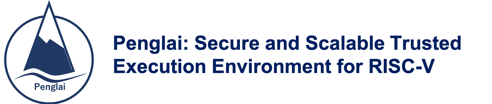

This repo maintains Penglai supports for OpenEuler (experimental version).

## Info

- OpenSBI-based Penglai is maintained in [Nuclei SDK](https://github.com/Nuclei-Software/nuclei-linux-sdk/tree/dev_flash_penglai_spmp) now.

## Build

### OpenEuler Kernel

Follow the instructions in openeuler riscv gitee to compile OpenEuler kernel.

For example, download the OKL-5.10 in current directory, and compile with penglai's docker image:

	docker run --rm -it -v $(pwd):/env ddnirvana/penglai-enclave:v0.5 /bin/bash
	cd /env
	CROSS_COMPILE=riscv64-unknown-linux-gnu- make ARCH=riscv -j8

### OpenSBI (with Penglai supports)

	docker run --rm -it -v $(pwd):/env ddnirvana/penglai-enclave:v0.5 /bin/bash
	cd /env/opensbi-0.6
	CROSS_COMPILE=riscv64-unknown-linux-gnu- make O=build-oe/qemu-virt PLATFORM=qemu/virt FW_PAYLOAD=y FW_PAYLOAD_PATH=/env/Image

Note: the /env/Image is the image compiled OpenEuler Kernel Image.

A simpler way:

	./docker_cmd.sh docker
	#In the docker image
	./scripts/build_opensbi.sh

## Run OpenEuler with Penglai Supports

	qemu-system-riscv64 -nographic -machine virt \
	-smp 8 -m 2G \
	-kernel  /home/dd/devlop/penglai/penglai-openeular/opensbi/opensbi-0.6/build-oe/qemu-virt/platform/qemu/virt/firmware/fw_payload.elf  \
	-drive file=openEuler-preview.riscv64.qcow2,format=qcow2,id=hd0 \
	-object rng-random,filename=/dev/urandom,id=rng0 \
	-device virtio-rng-device,rng=rng0 \
	-device virtio-blk-device,drive=hd0  \
	-device virtio-net-device,netdev=usernet \
	-netdev user,id=usernet,hostfwd=tcp::12055-:22 \
	-append 'root=/dev/vda1 rw console=ttyS0 systemd.default_timeout_start_sec=600 selinux=0 highres=off mem=4096M earlycon' \
	-bios none

- The test qemu version is 5.2.0.
- The fw_payload.elf is the opensbi file.
- The openEuler-preview.riscv64.qcow2 is the disk image for OpenEuler.

## Quick Start (Old)

Penglai uses Docker for building and uses submodules to track different componets.

Therefore, the only requirement to build and run penglai-demo is:

- [Docker](https://docs.docker.com): for building/running Penglai
- Git: for downloading the code

The version for FPGA and RISC-V board is comming soon.

### Building

First, download the all the code:

`git clone https://github.com/Penglai-Enclave/Penglai-Enclave-sPMP.git`

Enter the penglai-enclave directory, `cd Penglai-Enclave`

And then,

`git submodule update --init --recursive`

Last, build penglai using our Docker image:

`./docker_cmd.sh build`

When the building process finished, you are ready to run the penglai demo.

## Running

In the penglai-enclave directory,

`./docker_cmd.sh qemu`

If everything is fine, you will enter a Linux terminal booted by Qemu with Penglai-installed.

Enter the terminal with the user name: root, and passwords: penglai.

**Insmod the enclave-driver**

`insmod penglai.ko`

And the, you can run a demo, e.g., a prime enclave, using

`./host  prime`

Here, the  `host` is an enclave invoker, which will start an enclave (name from input).

## License Details

Mulan Permissive Software License，Version 1 (Mulan PSL v1)

## Code Structures

- buildroot: The buildroot rootfs for Penglai (from Sifive's Freedom U-sdk)
- linux: The Untrusted OS kernel (kernel 4.15) for Penglai (from Sifive's Freedom U-sdk)
- monitor: The secure monitor of Penglai, implementing isolation using PMP/sPMP, based on BBL
- riscv-qemu: The modified qemu (4.1) to support sPMP
- scripts: some scripts to build/run Penglai demo
- conf: some configuration files to build Penglai
- copy-files: a temp dir to store files copied into Penglai

## Code Contributions

If you are developing Penglai, please use pull requests on **target submodule project** (not on the super project).

Please fell free to post your concerns, ideas, code or anything others to issues.

## Wiki

Please refer the wiki for more details

## Acknowledgements

The design of Penglai was inspired by Sanctum, Keystone and HexFive, thanks to their great work.
